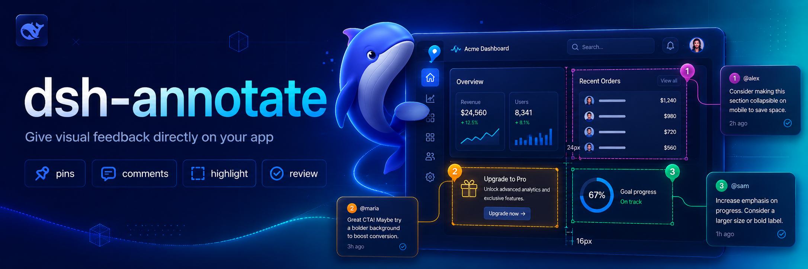

# dsh-annotate

> **本仓库是 [`BrambleXu/dsh-annotate`](https://github.com/BrambleXu/dsh-annotate) 的本地 fork（v0.2.0）**，
> 基线提交 `43f3954`（2026-08-14，MIT）。改动动机见下。

## fork 的改动：浏览器直接发起标注

上游必须先回 DeepSeek Harness 输入 `/annotate`，扩展才进入标注态 —— 而你人已经在浏览器里了，
这个方向是反的。本 fork 把它反过来：

```
上游：  DSH 打字 /annotate  →  浏览器进入标注态  →  点选  →  写评论  →  提交
本 fork：浏览器点扩展图标    →  直接进入标注态    →  点选  →  写评论  →  提交  →  自动进入当前会话
```

### 改动清单

**宿主侧（`src/`）**

- `protocol.ts` —— 新增 `submit` 消息（无 `requestId` 的直接提交）与 `ServerMessage` 类型。
- `bridge.ts` —— 接受**未经请求**的提交并经 `onSubmit` 回调投递；处理完回 `ack` 帧让扩展显示徽章；
  记录已连接扩展的 id 供 `/annotate-status` 显示。
- `index.ts` —— `inject` 增加 `agents`；用 `ctx.on('session/event', …)`
  跟踪**最近发过消息的会话**；新增 `/annotate-pin`、`/annotate-unpin`、`/annotate-status`；
  配置新增 `sessionId`（固定目标）与 `wake`（是否立即唤醒 agent）。

**扩展侧（`browser-extension/`）**

- `manifest.json` —— 移除 `default_popup`（否则 `action.onClicked` 不触发）；
  端点配置移入 `options_ui`；新增 `Alt+Shift+A` 快捷键；补上图标。
- `background.js` —— `action.onClicked` / `chrome.commands` 直接在被标注页面启动；
  徽章反馈连接状态与发送结果；截图失败时降级为无图提交而非整单失败。
  另外针对 **MV3 service worker 生命周期**做了三处加固（见下）。
- `content.js` —— 评论输入从原生 `window.prompt()` 换成**页内气泡**
  （多行、锚定元素、`⌘/Ctrl+Enter` 确认、`Esc` 取消）；界面中文化；
  提交后在页面底部弹出结果提示（成功 / 失败 / 超时），不再只有工具栏徽章；
  `styles` 从 8 项扩到 17 项，补上 `fontSize` / `fontWeight` / `lineHeight` /
  `borderRadius` / `boxShadow` / `opacity` / `zIndex` / `overflow` / `gap`。
- `options.html` / `options.js` —— 新增设置页（连接状态、端点、扩展 ID）。

### MV3 service worker 生命周期：上游一个会静默丢数据的坑

Chrome 会在扩展 **30 秒无事件、无扩展 API 调用**后回收 service worker
（[官方生命周期文档](https://developer.chrome.com/docs/extensions/develop/concepts/service-workers/lifecycle)），
而**单纯开着的 WebSocket 不算活动** —— 只有收发消息才算（Chrome 116+ 规则）。
上游开完 socket 就不管了，于是：

- 30 秒后 SW 被回收 → socket 断开。上游的 `/annotate` 因此基本总是报「扩展未连接」。
- 更糟的是「点图标 → 标注」这条路：用户点选元素、写评论**必然**超过 30 秒，
  提交时 SW 已是新实例，内存里的请求状态丢失，`send()` 又因 socket 未 OPEN
  直接丢弃 —— **用户点了提交，什么都没发生，也没有任何提示**。

本 fork 的三处加固：

1. **心跳 + 自动重连**：每 20 秒调用一次扩展 API 重置空闲计时器，让 SW（和 socket）
   活下来，同时检查连接、断了就重连。**首次连接失败也按 2 秒重试** ——
   Chrome 可能先于 DSH 启动，或者扩展先于 DSH 被重载，这种情况不能就此躺平
   （否则扩展会一直静默地不连接，只能靠用户点一次图标才恢复）。
2. **状态存 `chrome.storage.session`**：SW 即使被回收，也能分辨这次提交是
   浏览器发起的还是 `/annotate` 发起的。
3. **发送前等连接，并回报结果**：提交时 content script 的 `sendMessage`
   会唤醒 SW，`sendFrame` 等 socket 就绪（最长 12 秒）再发，成功后等宿主 `ack`
   （最长 15 秒），最终把真实结果回传页面显示成提示 —— 不再静默丢弃。

宿主的 `/annotate` 也相应改成**等待扩展连接**（最长 10 秒）而不是立刻失败。

### 目标会话怎么定

宿主**无法知道你在看哪个会话**（DSH 没有 `currentSession` 概念，会话头也只有一个 `createdAt`）。
所以按优先级解析：

1. `/annotate-pin` 固定的会话（本次运行内有效）
2. 配置里的 `sessionId`（写死在 profile 里）
3. **最近发过用户消息的会话** —— 也就是你最后打字的那个
4. 只剩一个顶层 agent 时用它

都不满足就报错，不会瞎投。

第 3 条只认 `event.data.source.kind === 'user'` 的 `user/message`。这一点很关键：
goal 轮次、定时任务、别的插件的通知、以及**本插件自己投递的标注**
都会追加 `user/message`，不过滤的话一次后台注入就能把标注目标抢到别的会话去。
这个判据不是自己发明的 —— 宿主算 `lastPromptAt` 用的就是同一个
（`dsh-api-session-controller`）。

### 用法

```sh
# 装机（desktop profile）
dsh plugin --profile desktop add /path/to/dsh-annotate

# 然后在 Chrome 里加载已解压的扩展
# chrome://extensions → 开发者模式 → 加载已解压的扩展程序 → 选 browser-extension/
```

标注时：点扩展图标（或 <kbd>Alt</kbd>+<kbd>Shift</kbd>+<kbd>A</kbd>）→ 点页面元素 → 写评论 →
可连续多条 → 点「提交」。提交后页面底部会弹出结果提示（成功 / 失败 / 超时），
工具栏徽章同步显示 ✓，悬停可看进了哪个会话。

### 改配置要重启，改扩展只要重载

- **插件代码或配置**（`cordis.patch.yml`、`lib/`）→ **必须重启 DSH**。
  profile 里虽然写着 `patchReload: live`、`hmr` 插件也在，但实测（改两次用户
  patch 层、观察 40 秒以上）插件不会重载，日志里也没有任何 hmr/watch 记录。
  代码层面 `watchUserPatches` 在 HMR 返回 `INACTIVE_EFFECT` 时会**静默返回一个
  空 disposer**，打包版应用很可能就是走的这条静默路径 —— 所以不要指望热重载。
- **扩展代码**（`browser-extension/`）→ 到 `chrome://extensions` 点卡片上的 **↻**
  重载即可，不用动 DSH。Chrome 不会自动重载已解压的扩展。

---

## 上游文档



<p align="center">
  <a href="LICENSE"></a>
  <a href="package.json">=24"></a>
  <a href="package.json"></a>
  <a href="package.json"></a>
</p>

<p align="center">
  <a href="https://github.com/awesome-dsh-plugin/awesome-dsh-plugin#development--runtime"></a>
</p>

<p align="center">English | <a href="README.zh.md">中文</a></p>

Visual browser feedback for DeepSeek Harness. `/annotate` asks the companion Chrome extension to enter selection mode; each selected element contributes a selector, DOM facts, computed style highlights, accessibility data, a comment, and an optional viewport screenshot to the agent's next turn.

## Why this exists 💡

Browser UI problems are difficult to describe precisely through plain text. `dsh-annotate` lets you point at the relevant element and send the Agent the surrounding browser facts, so visual feedback stays attached to the page element instead of becoming a vague description or a copied screenshot.

## Features ✨

- Select elements directly in Chrome or Chromium through `/annotate`.
- Capture selectors, DOM facts, computed-style highlights, accessibility data, comments, and optional viewport screenshots.
- Send structured annotations to the Agent through a local loopback WebSocket bridge.
- Restrict browser connections by loopback host, extension origin, and optional extension ID.

## Install 📦

Add the plugin project to a Harness profile:

```sh
dsh plugin --profile demo add ./dsh-annotate
```

Then install the companion extension:

1. Open `chrome://extensions` in Chrome or Chromium.
2. Enable **Developer mode**.
3. Choose **Load unpacked** and select this project's `browser-extension` directory.
4. Open the extension popup and keep the default bridge endpoint.

For tighter local authorization, copy the extension ID shown in the popup into `allowedExtensionId` in a later Harness patch layer.

## Use 🚀

```text
/annotate
/annotate http://localhost:3000
```

Click an element, enter its comment, and repeat as needed. **Submit** sends all captured facts and the visible-tab screenshot to the agent. **Escape** cancels.

## Configure ⚙️

```yaml
- id: dsh-annotate
  name: dsh-annotate
  config:
    host: 127.0.0.1
    port: 43119
    allowedExtensionId: abcdefghijklmnopqrstuvwxyzabcdef
    requestTimeoutMs: 300000
    maxPayloadBytes: 16777216
    includeScreenshot: true
```

The server refuses non-loopback hosts and browser connections whose origin is not `chrome-extension://`. An empty `allowedExtensionId` accepts any locally installed Chrome extension; set the exact ID for stricter isolation.

## Develop 🧑‍💻

```sh
pnpm install
pnpm run check
```

Reload the unpacked browser extension after editing its files.

## Scope 🎯

Version 0.1 targets one local Chrome/Chromium browser, one active tab, and visible-viewport screenshots. Remote browsers, full-page capture, edit recording, and inline draggable note cards are deferred.

## License 📄

MIT

## Credits 🙏

The interaction is inspired by [`pi-annotate`](https://github.com/nicobailon/pi-annotate). This implementation is built around Harness's human-command, attachment, and Agent APIs and uses a small loopback WebSocket bridge instead of a native-messaging host.
